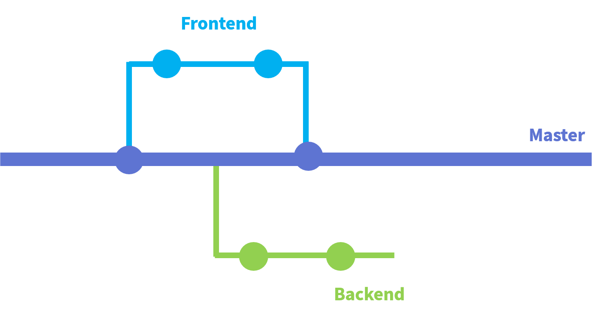

## Git branch로 관리하기

### 기본 사용법

```bash
# 모든 파일 stage로 올리기
$ git add .

# 특정 파일 stage로 올리기
$ git add <file name>

# 커밋메세지 작성 - 최대한 상세하게 작성해주세요!
$ git commit -m "Modify template"

# github repo에 올리기
$ git push origin master

# 추가로 알아두면 좋은 정보들

# ex) untracked ... => 파일 add로 stage에 올라가지 않음 - 반영이 안되었음
# ex1) 녹색 글씨 => staging 상태 / 빨간 글씨 => unstaging 상태 등
# 에러 코드를 보고 검색하면 해결하기 좋습니다

# 현재 브랜치의 상태를 알려준다
$ git status

# 커밋이력 조회 => 뒤에 oneline을 붙여주면 보기 쉽게 보여줍니다
$ git log <--oneline>

# 현재 연결된 repository 조회
$ git remote -v

# [out] <branch name> <repository 주소> 형태로 출력됩니다.
```


### 공동 작업

> 전체적인 프로세스는 다음과 같습니다.
>
> 1. 저장소를 등록한다
> 2. 마스터 브랜치가 아닌 브랜치를 생성해서 해당 브랜치로 repo의 내용을 pull 받습니다.
> 3. 여기서 작업을 마치고 (해당브랜치)로컬에서 커밋 푸쉬를 시행합니다.
> 4. 그 후 repo(네트워크 상)로 들어가 pull request를 신청합니다

* **마스터 브랜치는 항상 상시 배포 가능한 상태를 유지해야 합니다!**
* 브랜치 이름은 기능별로 구현하는 연습을 하면 좋을 것 같습니다. ex) frontend, backend

```bash
# 브랜치 목록 확인
$ git branch
# [out] <브런치 명> <주소> 형식으로 출력됩니다

# 브랜치 만들기
$ git branch <branch name>

# 브랜치 이동
$ git switch <branch name>

# 만들고 이동까지 하기
```



<center>대략 이런 모습으로 작동합니다</center>